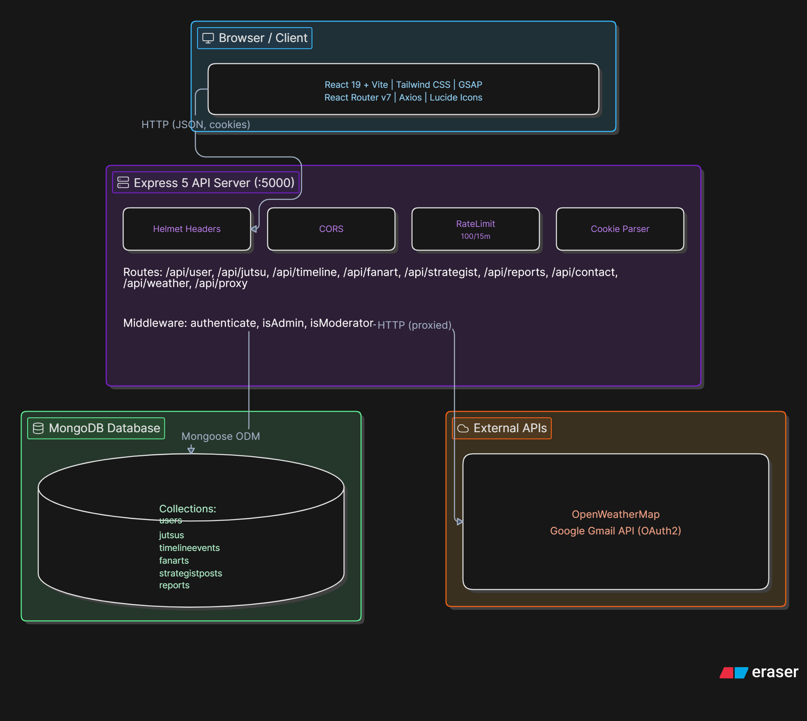

# Architecture Overview
 
This document describes the system architecture of the Temari Fan App how the pieces fit together, how data flows through the system, and the rationale behind key technical decisions.
 
---



---
 
## Frontend Architecture
 
### State Management
 
The app uses **React Context** for global state rather than an external state library. Three contexts are provided at the app root:
 
**`AuthContext`** — tracks the current user session
- Stores the authenticated user object
- Exposes `login()`, `logout()`, `register()`, and `isAuthenticated`
- On mount, makes a request to `/api/user/profile` to hydrate session state from the existing cookie
**`WeatherContext`** — real-time weather data
- Fetches from `/api/weather` based on the user's geolocation (or a default)
- Weather data drives the `WindBackground` particle effect (wind speed → particle velocity, weather condition → particle density)
- Refreshes on a polling interval
**`ThemeContext`** — light/dark/auto theme
- Defaults to `auto` (follows OS preference via `prefers-color-scheme`)
### Routing
 
React Router v7 is used with a flat route structure defined in `App.jsx`. All routes render within the shared `Navigation` + `Footer` shell. Protected routes redirect to `/login` when `isAuthenticated` is false.
 
### Component Hierarchy
 
```
App.jsx
├── AuthContext.Provider
├── ThemeContext.Provider
├── WeatherContext.Provider
│   ├── WindBackground.jsx        (fixed-position canvas layer, z-index behind content)
│   ├── Navigation.jsx            (sticky top bar)
│   ├── <Routes>
│   │   ├── Home.jsx
│   │   ├── JutsuShowcase.jsx
│   │   ├── Timeline.jsx
│   │   ├── FanArtGallery.jsx
│   │   ├── StrategistCorner.jsx
│   │   ├── Profile.jsx           (protected)
│   │   ├── Login.jsx
│   │   ├── Register.jsx
│   │   ├── Guidelines.jsx
│   │   ├── ReportIssue.jsx       
│   │   └── ContactUs.jsx
│   └── Footer.jsx
```
 
### Wind Background Effect
 
`WindBackground.jsx` uses **GSAP** to animate wind particles on an HTML canvas (or SVG — see source). Key design decisions:
 
- Particle count and velocity are derived from live `windSpeed` in `WeatherContext`
- Particle opacity and direction respond to `windDeg`
- On mobile or when `preferences.windEffect` is false, the effect is disabled to preserve battery and performance
- Uses `requestAnimationFrame` via GSAP's ticker for smooth 60fps rendering
---
 
## Backend Architecture
 
### Request Lifecycle
 
```
Incoming request
    │
    ▼
Express middleware chain
    ├── Helmet (security headers)
    ├── CORS (origin check)
    ├── CookieParser
    ├── express.json (body parsing)
    ├── express.static (public/uploads)
    └── RateLimit (100 req / 15 min per IP)
    │
    ▼
Route handler
    ├── [optional] authenticate middleware → reads req.cookies.token
    ├── [optional] isAdmin / isModerator
    └── Business logic → Mongoose query → JSON response
```
 
### Authentication Flow
 
```
POST /api/user/login
    │
    ▼
Validate credentials (bcrypt.compare)
    │
    ▼
Sign JWT (jsonwebtoken, 7-day expiry)
    │
    ▼
Set HTTP-only cookie: res.cookie('token', jwt, { httpOnly: true, secure: prod })
    │
    ▼
Return user object (no token in body)
 
Subsequent requests:
    Cookie sent automatically by browser
    authenticate middleware reads req.cookies.token
    jwt.verify() → decoded.id → User.findById()
    req.user = user  →  passed to route handler
```
 
**Why HTTP-only cookies?** Tokens stored in `localStorage` are vulnerable to XSS attacks — any injected script can read them. HTTP-only cookies are inaccessible to JavaScript and are sent automatically with same-origin requests, providing better security with no extra client-side handling.
 
### Image Upload Pipeline
 
```
Client (multipart/form-data)
    │
    ▼
Multer middleware
    ├── File size limit: 10MB
    ├── File type validation (JPEG, PNG)
    └── Stored to temp buffer
    │
    ▼
Sharp image processing
    ├── Resize to max 1200px width (preserve aspect ratio)
    ├── Compress JPEG (quality 85)
    └── Generate 400px thumbnail
    │
    ▼
Write to public/uploads/fanart/{id}.jpg
        public/uploads/thumbnails/{id}-thumb.jpg
    │
    ▼
Store relative URLs in MongoDB (FanArt.imageUrl, FanArt.thumbnailUrl)
```
 
Uploaded files are served via `express.static` from the `public/` directory with a 1-day client cache header.
 
### Email Architecture
 
The app uses **Gmail OAuth2** via the Google APIs client library rather than SMTP with an app password. This avoids Google's periodic deprecation of app passwords and provides finer-grained permission control.
 
```
config/email.js boots at server start
    │
    ├── Validates all required OAuth2 env vars (fails fast)
    └── Creates oauth2Client with Google credentials
 
POST /api/contact
    │
    ▼
createTransporter() called per request
    ├── oauth2Client.refreshAccessToken() → fresh access token
    └── nodemailer.createTransport({ auth: { type: 'OAuth2', ... } })
    │
    ▼
transporter.sendMail({ to: ADMIN_EMAIL, ... })
```
 
The refresh token approach means the server automatically handles token expiry — no manual rotation needed.
 
---
 
## Database Design
 
### Collections & Indexes
 
**`users`**
- Indexed: `email` (unique), `username` (unique)
- Notable fields: `isAdmin`, `isModerator`, `isBanned` (role/moderation system), `savedContent` (refs to other collections), `achievements` array
**`jutsus`**
- Indexed: `name`, `type`, `rank`, `isSignature`
- `animationData` sub-document drives the frontend particle system
**`timelineevents`**
- Indexed: `order` (for chronological sorting), `era + order` (compound, for era-filtered pages)
- `stats` sub-document powers the character stat cards in the timeline view
**`fanarts`**
- Stores relative paths to processed images and thumbnails
- `likes` is an array of User ObjectIds (not a counter) to prevent double-likes
**`strategistposts`**
- `replies` is an embedded array (not a separate collection) — suitable given expected reply volume
- Indexed: `createdAt` (newest-first default sort)
**`reports`**
- `status` field: `open` → `in-progress` → `resolved` / `closed`
- Linked to the submitting user via ObjectId ref
### Schema Relationships
 
```
User ──────────────────────────────────────────────────┐
 │ savedContent.fanArt  →  FanArt._id                  │
 │ savedContent.posts   →  StrategistPost._id           │
 │ savedContent.jutsus  →  Jutsu._id                   │
 │                                                      │
FanArt.submittedBy  →  User._id                        │
FanArt.likes[]      →  User._id                        │
                                                        │
StrategistPost.author        →  User._id               │
StrategistPost.replies[].author  →  User._id           │
                                                        │
Report.submittedBy  →  User._id                        │
User.bannedBy       →  User._id  ─────────────────────┘
```
 
---
 
## Security Considerations
 
| Concern | Mitigation |
|---|---|
| XSS token theft | JWT in HTTP-only cookie |
| CSRF | SameSite cookie attribute; CORS origin whitelist |
| Brute force login | Rate limiting (100 req / 15 min per IP) |
| Header attacks | Helmet.js (X-Frame-Options, CSP, HSTS, etc.) |
| Password storage | bcrypt with 10 salt rounds |
| Secrets in code | Environment variables; `.env` excluded from git |
| NoSQL injection | Mongoose schema type coercion; no raw query string interpolation |
| File upload abuse | Multer size limits; Sharp strips EXIF; type validation |
| Privilege escalation | Role flags checked server-side per request, not trusted from client |
 
---
 
## Performance Considerations
 
- **MongoDB indexes** are defined on every field used in `find()`, `sort()`, or `findOne()` queries
- **Image thumbnails** are generated at upload time (not on the fly) so gallery pages serve pre-sized images
- **Weather API** calls are proxied through the backend to keep the API key secret and to allow future server-side caching
- **GSAP wind effect** respects `prefers-reduced-motion` and is disabled on mobile to preserve battery
- **Static files** (`public/uploads`) are served with `Cache-Control: max-age=86400` (1 day)
- **Rate limiting** protects the server from both abuse and accidental request storms
---
 
## Future Architecture Considerations
 
The following are not yet implemented but are designed for without major refactoring:
 
- **Redis caching** — `REDIS_URL` is in `.env.example`; the weather proxy route is the primary candidate for caching (TTL ~10 min)
- **Image CDN** — `imageUrl` fields store relative paths that can be easily swapped to absolute CDN URLs
- **WebSocket notifications** — the `preferences.notifications` user flag is already stored; a Socket.IO layer could be added to `server.js` without restructuring routes
- **Automated testing** — route handlers are structured as pure async functions that receive `(req, res)` and are straightforward to unit test with `supertest`